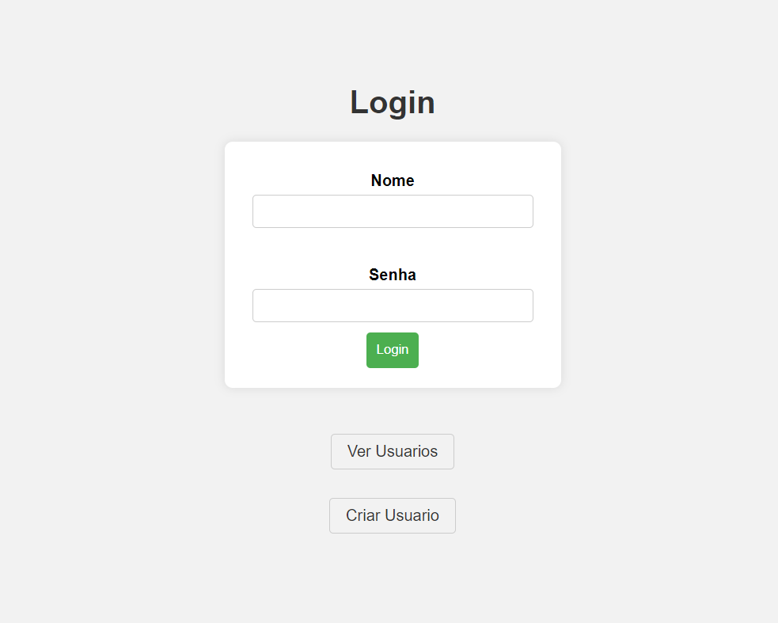
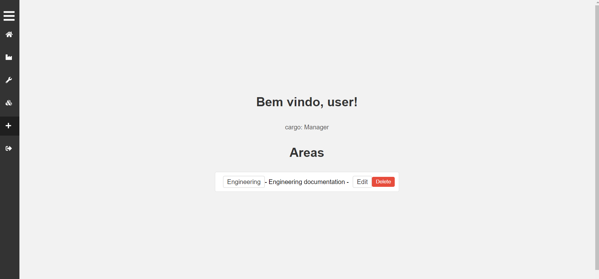

# Complex files management system

This is a project i'm developing to practice concepts linked to SQL and Flask. And also a way to solve some real project management problems.

## Table of contents

  - [The challenge](#the-challenge)
  - [Screenshot](#screenshot)
  - [Links](#links)
- [My process](#my-process)
  - [Built with](#built-with)
- [Author](#author)

### The challenge

Users should be able to:

- create an acount
- login
- Once loged in, create 'areas', 'subareas' and insert files in it
- then, recover the files when necessary.

The app should: 

- Manage the user credentials
- Manage user permitions based on the role.
- Manage the data ('areas', 'subareas' and files ) with sql 

### Screenshot

### Links

- Live Site URL: [ live site URL hre]()

## My process

### Built with

- HTML, CSS, JS 
- Python, flask, sqlite3

## Author

- Website - [TBD]()
- Frontend Mentor - [@RibeiroPorto](https://www.frontendmentor.io/profile/RibeiroPorto)
- LinkedIn - [Vinicius Ribeiro](https://www.linkedin.com/in/vinicius-ribeiro-8676b9234/)